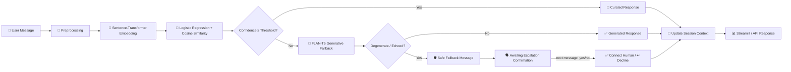

<div align="center">


<br/>


</div>

<br/>

## 📌 About The Project

**Intelligent Customer Support Chatbot** is a hybrid conversational AI system built to answer e-commerce customer support queries the way real production chatbots do — combining a **fast, deterministic intent classifier** for common questions with a **generative language model fallback** for anything open-ended.

Instead of relying on a single giant LLM for every message (slow, expensive, and prone to hallucinating policy details), this system uses a **two-tier architecture**:

- 🎯 **Tier 1 — Semantic Intent Classification** for known, high-frequency queries (order status, refunds, shipping, returns, payments...), returning instant, curated, business-approved answers
- 🧠 **Tier 2 — Transformer-Based Generative Fallback** (FLAN-T5) for anything outside that scope, using recent conversation history to stay context-aware
- 🗣️ **Conversational Memory** that tracks not just chat history but *pending questions the bot itself asked* — so a one-word "yes" to "want a human agent?" is understood correctly instead of confusing the model

> Built as a mid-level AI/ML internship project to demonstrate a real, production-style hybrid NLP pipeline — from calibrated confidence scoring to safe generative fallback handling.

<br/>

## ✨ Why This Project Is Useful

| Problem | How This Project Solves It |
|---|---|
| Single LLM for everything → slow & unpredictable | Two-tier design: instant curated replies for known intents |
| No confidence signal → bot guesses blindly | Confidence = softmax probability **+** cosine similarity to intent centroids |
| Generative models hallucinate policy details | Fallback only triggers for genuinely out-of-scope queries |
| Small models "echo" the prompt back as the answer | Built-in degeneration/echo detector swaps in a safe response |
| Bot forgets it just asked a yes/no question | Conversation state machine tracks pending confirmations |
| No memory across turns | Per-session context feeds the fallback model |
| Hard to demo to non-technical people | Polished Streamlit chat UI with live intent/confidence display |

<br/>

## 🎬 Demo Preview

<div align="center">

*(Add a GIF or screenshot of your running app here for maximum recruiter impact)*

```
💬 Type a message → 🎯 Instant intent match (or) 🧠 Generative fallback → ✅ Optional human escalation
```

</div>

<br/>

## 🚀 Features

- 🎯 **Semantic Intent Classification** — 14 e-commerce support intents (order status, refunds, shipping, returns, cancellations, discounts, address changes, and more)
- 🧮 **Calibrated Confidence Scoring** — blends logistic regression probability with embedding cosine similarity for reliable thresholds
- 🧠 **Generative Fallback (FLAN-T5)** — handles anything outside known intents, using recent conversation history as context
- 🛡️ **Degeneration Guard** — automatically detects broken/echoed generations and swaps in a safe response
- 🗣️ **Escalation Confirmation Flow** — remembers when it just offered a human agent, so "yes"/"no" replies are handled correctly instead of being misread as a fresh, unrelated message
- 💭 **Multi-turn Context Memory** — per-session history so follow-up questions are understood correctly
- 🏷️ **Entity Extraction** — automatically pulls order IDs from free text and fills them into responses
- 🚀 **FastAPI REST Backend** — production-style API with interactive Swagger docs at `/docs`
- 🖥️ **Streamlit Chat UI** — live intent + confidence display, with distinct badges for curated answers, fallback answers, and escalation outcomes
- 📊 **Automated Evaluation Pipeline** — accuracy, precision/recall/F1, and confusion matrix on a held-out test set
- 🔌 **Runs 100% locally** — no external API keys, no per-request costs beyond compute

<br/>

## 🏗️ Tech Stack

<div align="center">

| Layer | Technology |
|:---:|:---:|
| **Frontend / UI** |  |
| **REST API** |  + Uvicorn |
| **Embeddings** |  `all-MiniLM-L6-v2` |
| **Intent Classifier** |  Logistic Regression + cosine similarity |
| **Generative Fallback** |  `google/flan-t5-base` |
| **Deep Learning Backend** |  |
| **Data Handling** |   |
| **Core Language** |  |

</div>

<br/>

## 🧩 How It Works (Architecture)



1. **Preprocessing** — text is cleaned/normalized, and order IDs are extracted via regex.
2. **Embedding** — the message is converted into a 384-dimensional semantic vector.
3. **Classification** — a logistic regression model predicts an intent; confidence is the **max** of its softmax probability and cosine similarity to that intent's example centroid (this fixes under-confident predictions on clean matches).
4. **Routing** — high confidence → curated, business-approved response; low confidence → FLAN-T5 generates a short, context-aware reply.
5. **Safety check** — generated output is scanned for echoing/degeneration before ever reaching the user; if it fails, a safe fallback message is shown instead and the bot remembers it just offered human escalation.
6. **Confirmation handling** — the next message is checked against that pending offer first, so "yes" reliably triggers escalation instead of being reclassified from scratch.
7. **Context update** — both the user's message and the bot's response are saved to per-session history for future turns.

<br/>

## 📂 Project Structure

```
customer_support_chatbot/
├── data/
│   ├── intents.json            # Training data: 14 intents, ~350 patterns, curated responses
│   └── test_data.json          # Held-out labelled data for evaluation
├── models/                     # Generated by train.py (git-ignored)
│   ├── intent_classifier.joblib
│   ├── label_encoder.joblib
│   ├── intent_centroids.joblib
│   └── evaluation_report.txt
├── src/
│   ├── __init__.py
│   ├── config.py                # Central configuration constants
│   ├── preprocessing.py         # Text cleaning, entity extraction, yes/no detection
│   ├── intent_classifier.py     # Embedding + classification + confidence logic
│   ├── context_manager.py       # Per-session memory + escalation-confirmation state
│   ├── response_generator.py    # Curated templates + generative fallback + degeneration guard
│   ├── chatbot_engine.py        # Orchestrates the full pipeline
│   └── evaluate.py              # Model evaluation script
├── train.py                     # Trains and saves the intent classifier
├── api.py                       # FastAPI backend (production interface)
├── app.py                       # Streamlit UI (demo interface)
├── requirements.txt
├── .gitignore
└── README.md
```

<br/>

## ⚙️ Installation & Setup (Windows PowerShell)

Follow these commands **exactly**, in order, after cloning/pulling the repo to your local machine.

### 1️⃣ Clone the repository

```powershell
git clone https://github.com/thrinathpolanki/customer-support-chatbot.git
cd customer-support-chatbot
```

### 2️⃣ Create a virtual environment (Python 3.11 recommended)

```powershell
python -m venv venv
```

> ⚠️ **Not on Python 3.11.x?** Most ML dependencies here (`scikit-learn`, `torch`, `numpy`) only ship prebuilt installer wheels for a specific Python version range. On a too-new Python, `pip` tries to compile from source and fails without a C/C++ compiler. Use this instead:
> ```powershell
> py -3.11 --version
> py -3.11 -m venv .venv
> .venv\Scripts\Activate
> python --version
> python -m pip install --upgrade pip
> ```
> This forces the environment onto Python 3.11 specifically, regardless of what `python` points to by default on your system, and upgrades pip for better wheel resolution before installing anything else.

### 3️⃣ Activate the virtual environment

```powershell
venv\Scripts\activate
```

> ✅ Your terminal prompt should now show `(venv)` at the beginning.

### 4️⃣ Upgrade pip and install dependencies

```powershell
python -m pip install --upgrade pip
pip install -r requirements.txt
```

> `requirements.txt` uses minimum-version constraints (`>=`) rather than exact pins, specifically so pip can resolve to whichever compatible build actually has a prebuilt wheel for your system.

### 5️⃣ Train the intent classifier

```powershell
python train.py
```

This builds the classifier, label encoder, and intent centroids and saves them to `models/`.

### 6️⃣ Verify the installation

```powershell
python -c "import torch, streamlit, sentence_transformers, transformers; print('✅ All core packages installed successfully')"
```

<br/>

## ▶️ Running the App

**Option A — Streamlit Demo UI:**

```powershell
streamlit run app.py
```

The app will automatically open in your browser at:

```
http://localhost:8501
```

**Option B — FastAPI REST Backend:**

```powershell
uvicorn api:app --reload
```

Then open `http://127.0.0.1:8000/docs` for the interactive Swagger API docs.

> 💡 On first run, `all-MiniLM-L6-v2` and `google/flan-t5-base` download automatically from Hugging Face (a few hundred MB total) and are cached locally — subsequent runs work fully offline.

<br/>

## 🧪 How To Test It

Try these directly in the chat UI to exercise every part of the pipeline:

| Message | Expected Behavior |
|---|---|
| `"hi"` | 🎯 Greeting intent, high confidence |
| `"where is my order ORD12345"` | 🎯 Order status intent, order ID filled into the response |
| `"my money is deducted"` | 🎯 Payment issue intent (not a low-confidence fallback) |
| `"what's your favorite movie"` | 🧠 Generative fallback (genuinely out-of-scope) |
| *(after a fallback offers a human agent)* `"yes"` | ✅ "Connecting you now... please wait a few moments" |
| *(after that same offer)* `"no thanks"` | ↩️ Graceful decline, conversation continues normally |
| `"I want to talk to a human"` | 🎯 Human agent intent + immediate escalation flag |

Or evaluate the classifier directly:

```powershell
python -m src.evaluate
```

This prints accuracy, per-intent precision/recall/F1, and a confusion matrix, and saves the full report to `models/evaluation_report.txt`.

<br/>

## 🩹 Troubleshooting

<details>
<summary><b>pip fails trying to build scikit-learn / numpy / torch from source</b></summary>
<br/>

Your Python version likely has no prebuilt wheel for a pinned package. Switch to Python 3.11 using the `py -3.11` commands in Step 2 above.
</details>

<details>
<summary><b>KeyError: "Unknown task text2text-generation"</b></summary>
<br/>

This project loads FLAN-T5 directly via `AutoModelForSeq2SeqLM` (not the `pipeline()` task-string API) specifically to avoid this issue across different `transformers` versions.
</details>

<details>
<summary><b>Bot uses the fallback for obvious messages</b></summary>
<br/>

Re-run `python train.py` to rebuild `intent_centroids.joblib`. You can also lower `CONFIDENCE_THRESHOLD` in `src/config.py`, or add more example phrasings to the relevant intent in `data/intents.json`.
</details>

<details>
<summary><b>"yes" after a fallback message isn't triggering human escalation</b></summary>
<br/>

Make sure you're on the latest `chatbot_engine.py` and `context_manager.py` — this flow relies on `ConversationContext.awaiting_escalation_confirmation`, which is only set when the fallback returns the exact `SAFE_FALLBACK_MESSAGE`.
</details>

<br/>

## 🗺️ Roadmap / Future Improvements

- [ ] Fine-tune a transformer classifier head instead of logistic regression
- [ ] Add Retrieval-Augmented Generation (RAG) over a real product/policy knowledge base for the fallback tier
- [ ] Persist conversation context in Redis for multi-instance deployments
- [ ] Active-learning loop: log low-confidence queries for human review and periodic retraining
- [ ] Wire in a real product catalog for `product_info` (search, compare, price, stock lookups)
- [ ] Dockerize for one-command deployment

<br/>

## 🤝 Contributing

Contributions, issues, and feature requests are welcome!

```powershell
# Fork the repo, then:
git checkout -b feature/your-feature-name
git commit -m "Add: your feature description"
git push origin feature/your-feature-name
# Then open a Pull Request 🚀
```

<br/>

## 📜 License

This project is licensed under the **MIT License** — free to use, modify, and distribute.

<br/>

---

<div align="center">

## 👨‍💻 Author


<br/>

[](https://github.com/thrinathpolanki)
[](https://linkedin.com/in/thrinathpolanki)
[](mailto:polankithrinath@gmail.com)

<br/>

### ⭐ If you found this project useful, consider giving it a star — it really helps!


</div>
